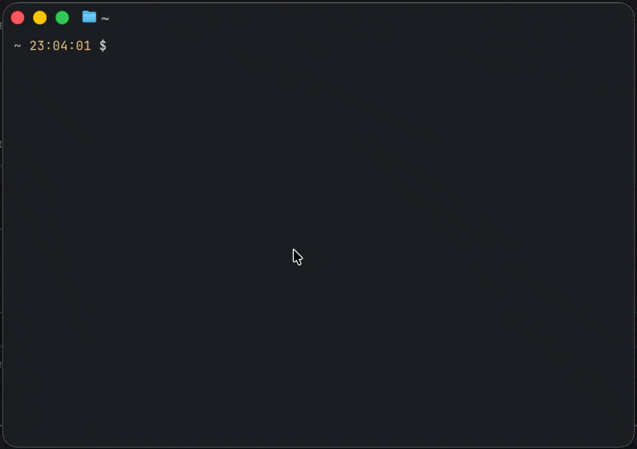

<p align="center">
  
</p>

<h1 align="center">remi</h1>

<p align="center"><strong>The CLI that Apple should have built for Reminders.</strong></p>

Create lists, add reminders, organize them into sections, and have everything sync across all your Apple devices — from the terminal.

<p align="center">
  
</p>

## Why remi?

- **Sections with iCloud sync** — the only CLI that supports Apple Reminders sections. Create them, assign reminders, move between them, and it all syncs.
- **Natural language** — `--due "next tuesday"`, `--repeat "every 2 weeks on monday,friday"`
- **Fuzzy matching** — type `remi list shopping` instead of `remi list "Groceries / Shopping List"`
- **Agent-first** — structured JSON output, Claude Code plugin, skills.sh skill, OpenClaw compatible
- **Fast** — compiled Swift helpers, no Electron, no GUI

### vs other tools

| | remi | [remindctl](https://github.com/steipete/remindctl) | [reminders-cli](https://github.com/keith/reminders-cli) |
|---|---|---|---|
| Sections | **Yes** | No | No |
| Section sync (iCloud) | **Yes** | N/A | N/A |
| Recurrence | **Yes** | Yes | No |
| Natural language dates | **Yes** | Yes | No |
| JSON output | **Yes** | Yes | No |
| AI agent integration | **Yes** | Partial | No |

## Install

```bash
brew tap mattheworiordan/tap && brew install remi
```

Or via npm:

```bash
npm install -g @mattheworiordan/remi
# or run without installing
npx @mattheworiordan/remi lists
```

## Quick start

```bash
remi lists                                              # See all lists
remi list "Groceries"                                   # View a list (fuzzy: remi list groceries)
remi add "Groceries" "Buy milk" --section "Dairy"       # Add to a section
remi today                                              # What's due today?
remi complete "Groceries" "milk"                        # Fuzzy complete
```

## Usage

### Check what's due

```bash
remi today                    # Due today
remi overdue                  # Past due
remi upcoming --days 7        # Coming up
remi search "dentist"         # Search across all lists
```

### Manage reminders

```bash
remi add "Work" "Review PR" --due "next friday" --priority high
remi add "Work" "Standup" --due tomorrow --repeat daily
remi complete "Work" "standup"
remi update "Work" "Review PR" --due "in 3 days"
remi delete "Work" "Review PR" --confirm
```

Dates: `tomorrow`, `next tuesday`, `in 3 days`, or `YYYY-MM-DD`
Recurrence: `daily`, `weekly`, `monthly`, `every 2 weeks`, `every 3 months on monday,friday`

### Organize with sections

```bash
remi sections "Groceries"                                # List sections
remi create-section "Groceries" "Produce"                # Create a section
remi add "Groceries" "Bananas" --section "Produce"       # Add to a section
remi move "Groceries" "Bananas" --to-section "Dairy"     # Move between sections
```

Sections sync to iCloud via CRDT vector clocks. See [how it works](docs/APPLE_REMINDERS_INTERNALS.md).

### JSON output

Every command supports `--json` for machine-readable output:

```bash
remi today --json
# {"success": true, "data": [...]}
```

## AI agent integration

remi is designed for AI agents. Install as a skill or plugin, and agents can manage your reminders:

```bash
# Claude Code plugin
claude plugin marketplace add mattheworiordan/remi

# skills.sh
npx skills add mattheworiordan/remi

# OpenClaw
clawhub install remi
```

## Permissions

On first run, macOS will ask you to grant Reminders access (click Allow). Section features also need Full Disk Access for your terminal app.

```bash
remi authorize    # Guides you through both
remi doctor       # Shows what's granted
```

## Requirements

- macOS 13+ (Ventura or later)
- Node.js 18+
- Xcode Command Line Tools (`xcode-select --install`)

## How it works

remi uses three layers because Apple never exposed sections in their public API:

| Layer | What | Why |
|-------|------|-----|
| **EventKit** | Reminder CRUD, queries, recurrence | Stable public API |
| **ReminderKit** | Section CRUD | Private framework — only way to create sections that sync |
| **SQLite + Token Maps** | Section membership | Direct database writes with CRDT vector clocks for iCloud sync |

The [full reverse-engineering story](docs/APPLE_REMINDERS_INTERNALS.md) explains what we discovered about Apple's undocumented sync architecture.

## Contributing

```bash
git clone https://github.com/mattheworiordan/remi.git && cd remi
npm install && npm run build:swift && npm run build
npm test                        # Unit tests
npm run test:integration        # Integration tests (needs Reminders access)
```

## License

MIT — [Matthew O'Riordan](https://github.com/mattheworiordan)
